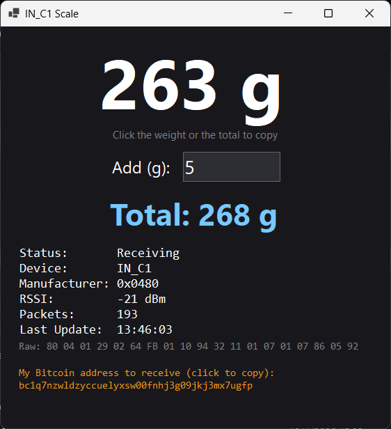

# IN_C1 Scale for Windows

**[English](#english) | [فارسی](#فارسی)**



---

<a name="english"></a>
## English

A tiny Windows app that shows the live weight of a Bluetooth scale named **IN_C1** directly on your PC, **without the phone app, without pairing, and without connecting**.

### Why is this useful?

- **No phone needed.** The original scale only works with an Android app. This app reads the weight straight from the scale's Bluetooth broadcast.
- **No pairing, no connection.** The scale just "announces" its weight over Bluetooth Low Energy. Windows listens, nothing more.
- **Great for online shops and warehouses.** When you enter product weights into a store panel (WooCommerce, HikaShop, Shopify, a spreadsheet, a shipping panel, etc.) you can:
  1. Put the item on the scale.
  2. **Click the big weight number** to copy it.
  3. Paste it into your panel.
- **Packaging weight built in.** Type the weight of the box or wrapping (in grams) into the **Add (g)** field. The app shows *item + packaging* as a smaller total. **Click it to copy.**
- **Single EXE.** No installer, no Python, no .NET to install. Download and run.

### Download

Go to the **[Releases page](https://github.com/OWNER/REPO/releases/latest)** and download `IN_C1_Scale.exe`.

### How to use

1. Turn on Bluetooth on your PC and turn on the scale.
2. Run `IN_C1_Scale.exe`.
3. The weight appears within a second. If the scale is off or too far, the status shows **No Signal**.
4. Click the weight to copy it. Type a number in **Add (g)** to see the total, then click the total to copy it.

> Windows may show a blue "SmartScreen" warning because the app is not digitally signed. Click **More info** then **Run anyway**. You can also read the source code in this repository and build it yourself.

### Requirements

- Windows 10 (2004+) or Windows 11, 64-bit
- A Bluetooth Low Energy adapter (most laptops have one)

### How it works

The scale sends non-connectable BLE advertisements with manufacturer ID `0x0480`. The weight is stored as a 16-bit big-endian number in grams, repeated twice in the packet (used as a simple sanity check). The app uses the Windows `BluetoothLEAdvertisementWatcher` API to listen for these packets.

### Limitations

- Tested only with the **IN_C1** scale. Other models may use a different format.
- Weight is shown in whole grams.
- Only the weight is decoded. The other bytes in the packet are not decoded.

### Build it yourself

Install the .NET 8 SDK, then:

```
dotnet publish -c Release -r win-x64 --self-contained true -p:PublishSingleFile=true
```

Or fork this repository and run the **Build IN_C1_Scale** workflow in the *Actions* tab.

### Disclaimer

This is an unofficial, independent project made by observing the scale's public Bluetooth broadcasts. It is not affiliated with the scale's manufacturer. Use at your own risk. Do not use it for legal-for-trade or medical measurements.

---

<a name="فارسی"></a>
<div dir="rtl">

## فارسی

یک برنامه‌ی کوچک ویندوز که وزن زنده‌ی ترازوی بلوتوثی **IN_C1** را مستقیم روی کامپیوتر نشان می‌دهد؛ **بدون اپلیکیشن گوشی، بدون Pair کردن و بدون اتصال**.

### چرا به درد می‌خورد؟

- **دیگر گوشی لازم نیست.** ترازوی اصلی فقط با یک اپ اندروید کار می‌کند. این برنامه وزن را مستقیماً از پیام‌های بلوتوثی ترازو می‌خواند.
- **بدون Pair و بدون اتصال.** ترازو وزن را با بلوتوث کم‌مصرف (BLE) «اعلام» می‌کند و ویندوز فقط گوش می‌دهد.
- **مناسب فروشگاه‌های آنلاین و انبار.** وقتی باید وزن کالاها را در پنل فروشگاه (ووکامرس، هیکاشاپ، شاپیفای، اکسل، پنل ارسال و ...) وارد کنید:
  1. کالا را روی ترازو بگذارید.
  2. **روی عدد بزرگ وزن کلیک کنید** تا کپی شود.
  3. در پنل Paste کنید.
- **وزن بسته‌بندی هم حساب می‌شود.** وزن کارتن یا کاور را (به گرم) در فیلد **Add (g)** بنویسید. مجموع *کالا + بسته‌بندی* با فونت کوچک‌تر نمایش داده می‌شود و **با کلیک روی آن کپی می‌شود.**
- **فقط یک فایل EXE.** بدون نصب، بدون Python و بدون نیاز به نصب .NET. دانلود کنید و اجرا کنید.

### دانلود

به **[صفحه‌ی Releases](https://github.com/OWNER/REPO/releases/latest)** بروید و فایل `IN_C1_Scale.exe` را دانلود کنید.

### طرز استفاده

1. بلوتوث کامپیوتر و ترازو را روشن کنید.
2. فایل `IN_C1_Scale.exe` را اجرا کنید.
3. وزن در کمتر از یک ثانیه نمایش داده می‌شود. اگر ترازو خاموش یا دور باشد، وضعیت **No Signal** می‌شود.
4. برای کپی وزن روی آن کلیک کنید. برای مجموع، عدد را در **Add (g)** بنویسید و روی مجموع کلیک کنید.

> چون برنامه امضای دیجیتال ندارد، ممکن است ویندوز هشدار آبی SmartScreen بدهد. روی **More info** و بعد **Run anyway** بزنید. اگر اطمینان نداشتید، سورس‌کد همین ریپو را بخوانید و خودتان Build کنید.

### نیازمندی‌ها

- ویندوز ۱۰ (نسخه‌ی 2004 به بالا) یا ویندوز ۱۱، ۶۴ بیتی
- کارت بلوتوث کم‌مصرف (BLE). بیشتر لپ‌تاپ‌ها دارند.

### چطور کار می‌کند؟

ترازو پیام‌های BLE غیرقابل‌اتصال با شناسه‌ی سازنده‌ی `0x0480` ارسال می‌کند. وزن به‌صورت یک عدد ۱۶ بیتی Big-Endian بر حسب گرم در پکت قرار دارد و دو بار تکرار می‌شود (برای یک کنترل ساده). برنامه با API ویندوز به نام `BluetoothLEAdvertisementWatcher` به این پکت‌ها گوش می‌دهد.

### محدودیت‌ها

- فقط با ترازوی **IN_C1** تست شده است. مدل‌های دیگر ممکن است فرمت متفاوتی داشته باشند.
- وزن به گرمِ صحیح نمایش داده می‌شود.
- فقط وزن رمزگشایی می‌شود. سایر بایت‌های پکت بررسی نشده‌اند.

### خودتان Build کنید

.NET 8 SDK را نصب کنید و بزنید:

```
dotnet publish -c Release -r win-x64 --self-contained true -p:PublishSingleFile=true
```

یا ریپو را Fork کنید و در تب *Actions* گزینه‌ی **Build IN_C1_Scale** را اجرا کنید.

### سلب مسئولیت

این یک پروژه‌ی غیررسمی و مستقل است که از روی پیام‌های بلوتوثی عمومیِ ترازو ساخته شده و ارتباطی با سازنده‌ی ترازو ندارد. استفاده بر عهده‌ی خودتان است. برای اندازه‌گیری‌های قانونی-تجاری یا پزشکی استفاده نکنید.

</div>
